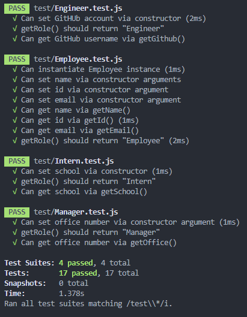

  # CLI Team Profile Generator - Node

  

  ## Descripton
  A CLI that prompts a user for team manager information and any additional team members. User can input any number of team members, and it may be a mix of engineers and interns. When finished building the team, the application creates a HTML file that displays the team roster based on the information provided by the user. 

  ## Table of Contents
  * [Installation](#installation)
  * [Usage](#usage)
  * [Contributing](#contributing)
  * [Tests](#tests)
  * [Questions](#questions)

  ## Installation 
    
  *Steps required to install package:* 
    
  Application requires inquirer to run. This has been included in the package.json and "npm i" may be utilized. 

  ## Usage

  *Examples of project use:*

  Will Implement Example

  ## Contributing

  *If you are interested in contributing to this project, please follow the below instructions:*

  Contributions not welcome at this time. 

  ## Tests

  *Application tests and instructions for them:*

  All application tests can be found in the test folder and can be ran through the terminal utilizing the command "npm run test". 

  
  
  

  ## License

  None
  

  ## Questions

  *If you have any questions regarding this application, please utilize the below contact information:*

  [kmiller343@gmail.com](mailto:kmiller343@gmail.com)
  
  [GitHub Profile](https://www.github.com/k1te-m)
  
